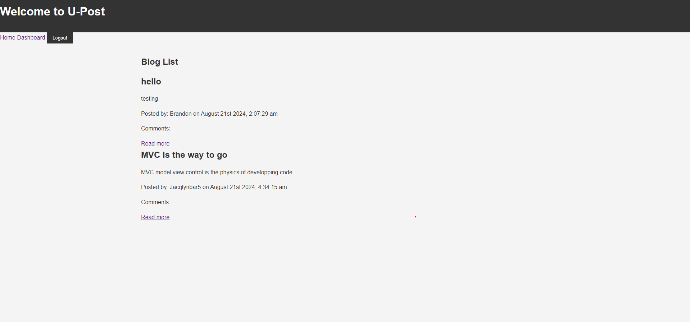

# U-Post

## Description

U-Post is a CMS-style blog site where developers can publish their blog posts and comment on other developers' posts. Built from scratch using the MVC paradigm, this application leverages Handlebars.js for templating, Sequelize as the ORM, and `express-session` for authentication.

## Landing Page:

## User Story

As a developer who writes about tech, I want a CMS-style blog site so that I can publish articles, blog posts, and my thoughts and opinions.

## Acceptance Criteria

### Homepage

- **When visiting the site for the first time:**
  - Presented with the homepage, which includes existing blog posts (if any), navigation links for the homepage and the dashboard, and the option to log in.

- **Clicking on the homepage option:**
  - Taken to the homepage.

- **Clicking on any other links in the navigation:**
  - Prompted to sign up or sign in.

### Sign-Up and Login

- **Choosing to sign up:**
  - Prompted to create a username and password.
  - Clicking on the sign-up button saves the credentials and logs the user in.

- **Re-visiting and choosing to sign in:**
  - Prompted to enter username and password.

- **When signed in:**
  - Navigation links for the homepage, dashboard, and an option to log out are visible.

### Blog Post Interaction

- **Clicking on the homepage option:**
  - Taken to the homepage with existing blog posts displayed (post title and date created).

- **Clicking on an existing blog post:**
  - Presented with the post title, contents, creator’s username, and date created.
  - Option to leave a comment if signed in.

- **Entering and submitting a comment (while signed in):**
  - Comment is saved and displayed with the creator’s username and date created.

### Dashboard

- **Clicking on the dashboard option:**
  - Taken to the dashboard with any existing blog posts and an option to add a new blog post.

- **Clicking to add a new blog post:**
  - Prompted to enter a title and contents.
  - Clicking on the button to create a new blog post saves the post and updates the dashboard.

- **Clicking on an existing post in the dashboard:**
  - Ability to delete or update the post and return to an updated dashboard.

### Logout and Idle State

- **Clicking on the logout option:**
  - Signed out of the site.

- **Being idle for more than a set time:** under development
  - Able to view posts and comments but prompted to log in again before adding, updating, or deleting posts.

## Technologies Used

- **Frontend:** Handlebars.js for templating.
- **Backend:** Node.js, Express.js.
- **Database:** PostgreSQL, Sequelize ORM.
- **Authentication:** express-session for user sessions.

## Deployed via Render cand view the website via this link: https://u-post-duhp.onrender.com/login

## Credits/ Citations/Contributions:
Collaborated with UT austin Bootcamp instructor on resolving merge conficts. Also used exercises for boilerplate code from MVC week 14 course work. AI was used for trouble-shooting server errors, there was a conceptual phsase where oprtunity presented to be more mindful of tagging and id's when referenceing in the MVC framework. AI sources assisted with calling out these inconsistencies in my code. 

connect-session-sequelize. (n.d.). npm. from https://www.npmjs.com/package/connect-session-sequelize

Express-handlebars. (n.d.). npm. Retrieved from https://www.npmjs.com/package/express-handlebars

Handlebars.js: Introduction. (n.d.). Handlebars.js.  2024, from https://handlebarsjs.com/guide/

UTA-VIRT-FSF-PT-05-2024-U-LOLC. (2024). GitHub. Retrieved, 2024, from https://git.bootcampcontent.com/University-of-Texas-at-Austin/UTA-VIRT-FSF-PT-05-2024-U-LOLC/-/tree/main/14-MVC/

## Future Deployments
-working on providing more styling
-re-configuring the time out for login sessions
-splitting the login and sign up into separate screens that users can toggle between. Add a feature for editing posts. 

## License: 
MIT License

Copyright (c) 2024 bldambtn

Permission is hereby granted, free of charge, to any person obtaining a copy of this software and associated documentation files (the "Software"), to deal in the Software without restriction, including without limitation the rights to use, copy, modify, merge, publish, distribute, sublicense, and/or sell copies of the Software, and to permit persons to whom the Software is furnished to do so, subject to the following conditions:

The above copyright notice and this permission notice shall be included in all copies or substantial portions of the Software.

THE SOFTWARE IS PROVIDED "AS IS", WITHOUT WARRANTY OF ANY KIND, EXPRESS OR IMPLIED, INCLUDING BUT NOT LIMITED TO THE WARRANTIES OF MERCHANTABILITY, FITNESS FOR A PARTICULAR PURPOSE AND NONINFRINGEMENT. IN NO EVENT SHALL THE AUTHORS OR COPYRIGHT HOLDERS BE LIABLE FOR ANY CLAIM, DAMAGES OR OTHER LIABILITY, WHETHER IN AN ACTION OF CONTRACT, TORT OR OTHERWISE, ARISING FROM, OUT OF OR IN CONNECTION WITH THE SOFTWARE OR THE USE OR OTHER DEALINGS IN THE SOFTWARE.
